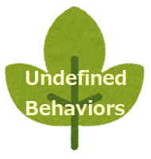

# c_articles
These are my articles about C language.

## Contents


- [Unknown and unforgivable specifications of the C language](https://github.com/y-tetsu/c_articles/tree/main/unknown_and_unforgivable#unknown-and-unforgivable-specifications-of-the-c-language)


- [I'm so tired of undefined behaviors, I can't move...](https://github.com/y-tetsu/c_practice/tree/main/ub)


- [10 Reserved Words Beginning with Underscore](https://github.com/y-tetsu/c_practice/tree/main/underscore)


## Environment

```
$ gcc --version
gcc (x86_64-posix-seh-rev0, Built by MinGW-Builds project) 14.1.0
Copyright (C) 2024 Free Software Foundation, Inc.
This is free software; see the source for copying conditions.  There is NO
warranty; not even for MERCHANTABILITY or FITNESS FOR A PARTICULAR PURPOSE.
```

