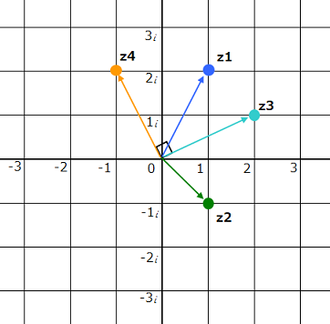

# 10 Reserved Words Beginning with Underscore


# About Reserved Words

# Meaning of underscore

# Keywords beginning with underscore

## type-related series
Let's start with the easy ones.

All of them are the same as `int` and `double`, and specify the “type” of the variable.

> `_Bool`、`_Complex`、`_Imaginary`

### _Bool

```bool.c
#include <stdio.h>

int main()
{
    _Bool a;
    int i;

    for (i=0; i<5; i++)
    {
        a = i;
        printf("a = %d -> %d\n", i, a);
    }

    return 0;
}
```

```
$ gcc ./bool.c -o bool
$ ./bool
a = 0 -> 0
a = 1 -> 1
a = 2 -> 1
a = 3 -> 1
a = 4 -> 1
```


```stdbool.c
#include <stdio.h>
#include <stdbool.h>

int main()
{
    bool a;

    a = true;
    printf("true  = %d\n", a);

    a = false;
    printf("false = %d\n", a);

    a = 5;
    printf("5     = %d\n", a);

    return 0;
}
```

```
$ gcc ./stdbool.c -o stdbool
$ ./stdbool
true  = 1
false = 0
5     = 1
```


### _Complex

```complex.c
#include <stdio.h>
#include <complex.h>

int main()
{
    double _Complex z1 = 1.0 + 2.0 * I;  // 1 + 2i
    double _Complex z2 = 1.0 - 1.0 * I;  // 1 - i

    printf("z1 : %.1f + %.1fi\n", creal(z1), cimag(z1));
    printf("z2 : %.1f + %.1fi\n", creal(z2), cimag(z2));

    double _Complex z3 = z1 + z2;
    printf("z3 : %.1f + %.1fi\n", creal(z3), cimag(z3));

    double _Complex z4 = z3 * I;
    printf("z4 : %.1f + %.1fi\n", creal(z4), cimag(z4));

    return 0;
}
```


```
$ gcc ./complex.c -o complex
$ ./complex
z1 : 1.0 + 2.0i
z2 : 1.0 + -1.0i
z3 : 2.0 + 1.0i
z4 : -1.0 + 2.0i
```




### _Imaginary

```imaginary.c
#include <stdio.h>
#include <complex.h>

int main()
{
    double _Imaginary z = 3.0 * I;

    printf("%.1fi\n", cimag(z));

    return 0;
}
```


```
$ gcc ./imaginary.c -o imaginary
imaginary.c: In function 'main':
imaginary.c:6:12: error: expected identifier or '(' before '_Imaginary'
    6 |     double _Imaginary z = 3.0 * I;
      |            ^~~~~~~~~~
imaginary.c:8:29: error: 'z' undeclared (first use in this function)
    8 |     printf("%.1fi\n", cimag(z));
      |                             ^
imaginary.c:8:29: note: each undeclared identifier is reported only once for each function it appears in
```


## Series on multithreaded processing
Next, we will look at those related to multi-threaded processing (a mechanism in which a single program performs multiple tasks at the same time).

> `_Atomic`、`_Thread_local`

### _Atomic

```no_atmic.c
#include <stdio.h>
#include <pthread.h>

int counter = 0;

void *thread_func(void* arg)
{
    for (int i=0; i<1000000; i++)
    {
        counter++;
    }

    return NULL;
}

int main()
{
    pthread_t thread1, thread2;

    pthread_create(&thread1, NULL, thread_func, NULL);
    pthread_create(&thread2, NULL, thread_func, NULL);

    pthread_join(thread1, NULL);
    pthread_join(thread2, NULL);

    printf("counter: %d\n", counter);

    return 0;
}
```

```
$ gcc ./no_atomic.c -o no_atomic
$ ./no_atomic
counter: 1438044
```

```atmic.c
#include <stdio.h>
#include <pthread.h>
#include <stdatomic.h>

_Atomic int counter = 0;

void *thread_func(void* arg)
{
    for (int i=0; i<1000000; i++)
    {
        atomic_fetch_add(&counter, 1);
    }

    return NULL;
}

int main()
{
    pthread_t thread1, thread2;

    pthread_create(&thread1, NULL, thread_func, NULL);
    pthread_create(&thread2, NULL, thread_func, NULL);

    pthread_join(thread1, NULL);
    pthread_join(thread2, NULL);

    printf("counter: %d\n", counter);

    return 0;
}
```


```c
_Atomic int counter = 0;
```

```c
#include <stdatomic.h>
atomic_fetch_add(&counter, 1);
```


```
$ gcc ./atomic.c -o atomic
$ ./atomic
counter: 2000000
```


### _Thread_local

```thread_local.c
#include <stdio.h>
#include <pthread.h>

_Thread_local int counter = 0;

void *thread_func(void* arg)
{
    for (int i=0; i<1000000; i++)
    {
        counter++;
    }

    printf("thread_func counter : %d\n", counter);

    return NULL;
}

int main()
{
    pthread_t thread1, thread2;

    pthread_create(&thread1, NULL, thread_func, NULL);
    pthread_create(&thread2, NULL, thread_func, NULL);

    pthread_join(thread1, NULL);
    pthread_join(thread2, NULL);

    printf("counter: %d\n", counter);

    return 0;
}
```

```c
_Thread_local int counter = 0;
```

```c
void *thread_func(void* arg)
{
    for (int i=0; i<1000000; i++)
    {
        counter++;
    }

    printf("thread_func counter : %d\n", counter);

    return NULL;
}
```


```
$ gcc ./thread_local.c -o thread_local
$ ./thread_local
thread_func counter : 1000000
thread_func counter : 1000000
counter: 0
```


## Series on Alignment
Next are those related to alignment (boundary alignment rules to efficiently place data in memory).

> `_Alignof`、`_Alignas`

### _Alignof

```alignof.c
#include <stdio.h>

int main()
{
    char        a;
    short       b;
    int         c;
    long        d;
    long long   e;
    float       f;
    double      g;
    long double h;

    printf("char        : %2zu byte alignment\n", _Alignof(a));
    printf("short       : %2zu byte alignment\n", _Alignof(b));
    printf("int         : %2zu byte alignment\n", _Alignof(c));
    printf("long        : %2zu byte alignment\n", _Alignof(d));
    printf("long long   : %2zu byte alignment\n", _Alignof(e));
    printf("float       : %2zu byte alignment\n", _Alignof(f));
    printf("double      : %2zu byte alignment\n", _Alignof(g));
    printf("long double : %2zu byte alignment\n", _Alignof(h));

    return 0;
}
```

```
$ gcc ./alignof.c -o alignof
$ ./alignof
char        :  1 byte alignment
short       :  2 byte alignment
int         :  4 byte alignment
long        :  4 byte alignment
long long   :  8 byte alignment
float       :  4 byte alignment
double      :  8 byte alignment
long double : 16 byte alignment
```

### _Alignas

```c
_Alignas(alignment) type variable-name;
```

```no_alignas.c
#include <stdio.h>

int main()
{
    char a;
    char b;
    char c;
    short d;
    short e;
    int f;
    int g;
    int h;

    printf("a : alignment = %2zu, address = 0x%p\n", _Alignof(a), (void *)&a);
    printf("b : alignment = %2zu, address = 0x%p\n", _Alignof(b), (void *)&b);
    printf("c : alignment = %2zu, address = 0x%p\n", _Alignof(c), (void *)&c);
    printf("d : alignment = %2zu, address = 0x%p\n", _Alignof(d), (void *)&d);
    printf("e : alignment = %2zu, address = 0x%p\n", _Alignof(e), (void *)&e);
    printf("f : alignment = %2zu, address = 0x%p\n", _Alignof(f), (void *)&f);
    printf("g : alignment = %2zu, address = 0x%p\n", _Alignof(g), (void *)&g);
    printf("h : alignment = %2zu, address = 0x%p\n", _Alignof(h), (void *)&h);

    return 0;
}
```

```
$ gcc ./no_alignas.c -o no_alignas
$ ./no_alignas
a : alignment =  1, address = 0x0000001B899FF87F
b : alignment =  1, address = 0x0000001B899FF87E
c : alignment =  1, address = 0x0000001B899FF87D
d : alignment =  2, address = 0x0000001B899FF87A
e : alignment =  2, address = 0x0000001B899FF878
f : alignment =  4, address = 0x0000001B899FF874
g : alignment =  4, address = 0x0000001B899FF870
h : alignment =  4, address = 0x0000001B899FF86C
```

```alignas.c
#include <stdio.h>

int main()
{
    char a;
    char b;
    char c;
    _Alignas(int) short d;
    short e;
    int f;
    _Alignas(8) int g;
    _Alignas(16) int h;

    printf("a : alignment = %2zu, address = 0x%p\n", _Alignof(a), (void *)&a);
    printf("b : alignment = %2zu, address = 0x%p\n", _Alignof(b), (void *)&b);
    printf("c : alignment = %2zu, address = 0x%p\n", _Alignof(c), (void *)&c);
    printf("d : alignment = %2zu, address = 0x%p\n", _Alignof(d), (void *)&d);
    printf("e : alignment = %2zu, address = 0x%p\n", _Alignof(e), (void *)&e);
    printf("f : alignment = %2zu, address = 0x%p\n", _Alignof(f), (void *)&f);
    printf("g : alignment = %2zu, address = 0x%p\n", _Alignof(g), (void *)&g);
    printf("h : alignment = %2zu, address = 0x%p\n", _Alignof(h), (void *)&h);

    return 0;
}
```

```
$ gcc ./alignas.c -o alignas
$ ./alignas
a : alignment =  1, address = 0x000000B744DFF82F
b : alignment =  1, address = 0x000000B744DFF82E
c : alignment =  1, address = 0x000000B744DFF82D
d : alignment =  4, address = 0x000000B744DFF828
e : alignment =  2, address = 0x000000B744DFF826
f : alignment =  4, address = 0x000000B744DFF820
g : alignment =  8, address = 0x000000B744DFF818
h : alignment = 16, address = 0x000000B744DFF810
```


## Other
Lastly, the oddities that I couldn't manage to classify! I couldn't classify them.

> `_Noreturn`、`_Static_assert`、`_Generic`

### _Noreturn

```no_noreturn.c
#include <stdio.h>
#include <stdlib.h>

void goodbye()
{
    printf("good-bye here.\n");

    abort();

    printf("hello again. (but...)\n");
}

int main()
{
    goodbye();

    printf("never come back here.\n");

    return 0;
}
```

```
$ gcc ./no_noreturn.c -o no_noreturn -Wmissing-noreturn
no_noreturn.c: In function 'goodbye':
no_noreturn.c:4:6: warning: function might be candidate for attribute 'noreturn' [-Wsuggest-attribute=noreturn]
    4 | void goodbye()
      |      ^~~~~~~
$ ./no_noreturn
good-bye here.
```


```noreturn.c
#include <stdio.h>
#include <stdlib.h>

_Noreturn void goodbye()
{
    printf("good-bye here.\n");

    abort();

    printf("hello again. (but...)\n");
}

int main()
{
    goodbye();

    printf("never come back here.\n");

    return 0;
}
```

```
$ gcc ./noreturn.c -o noreturn -Wmissing-noreturn
$ ./noreturn
good-bye here.
```


```return.c
#include <stdio.h>
#include <stdlib.h>

_Noreturn void goodbye()
{
    printf("good-bye here.\n");

    abort();

    printf("hello again. (but...)\n");

    return;
}

int main()
{
    goodbye();

    printf("never come back here.\n");

    return 0;
}
```

```
$ gcc ./noreturn.c -o noreturn
return.c: In function 'goodbye':
return.c:12:5: warning: function declared 'noreturn' has a 'return' statement
   12 |     return;
      |     ^~~~~~
$ ./noreturn
abort here.
```


### _Static_assert

```static_assert.c
#include <stdio.h>

_Static_assert(sizeof(int) > 2, "16bit code not supported.");

int main()
{
    printf("OK.\n");

    return 0;
}
```

```
$ gcc ./static_assert.c -o static_assert
$ ./static_assert
OK.
```

```
$ gcc ./static_assert.c -o static_assert
static_assert.c:3:1: error: static assertion failed: "16bit code not supported."
    3 | _Static_assert(sizeof(int) > 2, "16bit code not supported.");
      | ^~~~~~~~~~~~~~
```


### _Generic

```generic.c
#include <stdio.h>

#define type_to_string(x) _Generic((x), \
    int:     "int",                     \
    double:  "double",                  \
    char *:  "string",                  \
    default: "unknown")

int main()
{
    int    a = 1;
    double b = 3.14;
    char  *c = "generic";
    float  d = 5.69;

    printf("type of a is \"%s\"\n", type_to_string(a));
    printf("type of b is \"%s\"\n", type_to_string(b));
    printf("type of c is \"%s\"\n", type_to_string(c));
    printf("type of d is \"%s\"\n", type_to_string(d));

    return 0;
}
```

```
$ gcc ./generic.c -o generic
$ ./generic
type of a is "int"
type of b is "double"
type of c is "string"
type of d is "unknown"
```

```
_Generic( `expression`, `type1`: `selection1`, `type2`: `selection2`, ..., `default`: `default_selection` )
```


```c
char* type_to_string(type x)
{
    switch (x)
    {
        case int:
            return "int";
        case double:
            return "double";
        case string:
            return "string";
        default:
            return "unknown";
    }

    return NULL;
}
```

# In Japanese
[【C言語】アンダースコアではじまる10の予約語](https://qiita.com/y-tetsu/items/06e5bf148bc70986bfbb)
